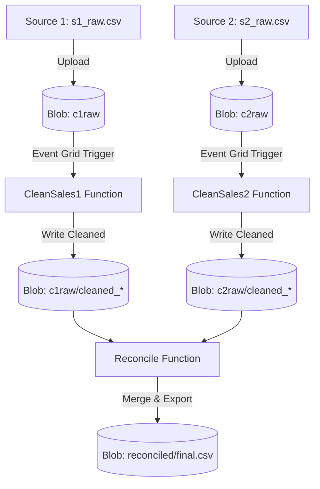

# 📊 Sales Data Cleaning & Reconciliation Pipeline

[](https://learn.microsoft.com/azure/azure-functions/)
[](https://www.python.org/)
[](https://pandas.pydata.org/)
[](https://opensource.org/licenses/MIT)

An enterprise-grade serverless data pipeline designed to ingest, clean, and reconcile sales data from multiple sources. This project leverages **Azure Functions** and **pandas** to automate high-volume data processing with a focus on scalability and separation of concerns.

---

## 🏗️ Architecture Overview

The pipeline follows a modular architecture where raw data ingestion triggers specific cleaning micro-services, followed by a final reconciliation layer.



### Core Components
| Component | Responsibility | Tech Stack |
| :--- | :--- | :--- |
| **CleanSales1** | Groups by `names` & `region`, filters for the `east` region. | Python, pandas, HTTP Trigger |
| **CleanSales2** | Groups by `names` & `item`, filters for `binder` types. | Python, pandas, HTTP Trigger |
| **Reconcile** | Performs an `outer join` on `names` to merge source datasets. | Python, pandas, HTTP Post |
| **Storage** | Emulated local storage with containers for raw, cleaned, and final data. | Azurite (Local Storage) |

---

## 🚀 Demonstration (Quick Start)

The project includes a **one-click automation script** that handles environment setup, service orchestration, and pipeline execution.

### Prerequisites
- [Azure Functions Core Tools v4](https://docs.microsoft.com/azure/azure-functions/functions-run-local)
- [Azurite](https://github.com/Azure/Azurite) installed via npm (`npm install -g azurite`)
- Python 3.8+

### Running the Pipeline
1. Open **PowerShell** as an Administrator.
2. Navigate to the project root:
   ```powershell
   cd C:\Users\venki\Data-pipeline
   ```
3. Execute the demo script:
   ```powershell
   powershell -ExecutionPolicy Bypass -File .\run_demo.ps1
   ```

**What happens during the demo?**
- **Orchestration:** Azurite and Azure Functions Host are started in the background.
- **Ingestion:** Sample CSVs are uploaded to local blob containers.
- **Processing:** `CleanSales1` and `CleanSales2` are triggered to process the raw data.
- **Finalization:** `Reconcile` merges the two outputs into a single reconciled report.

---

## 🛠️ Manual Development Setup

If you wish to run components individually or modify the logic:

### 1. Environment Setup
```powershell
python -m venv .venv
.\.venv\Scripts\activate
pip install -r requirements.txt
```

### 2. Local Storage Configuration
Start the storage emulator:
```powershell
azurite --location ./azurite_data --skipApiVersionCheck
```
Then, initialize the containers:
```powershell
python setup_local_storage.py
```

### 3. Launching Functions
```powershell
func start
```

---

## 🧠 Technical Deep Dive

- **Pandas Aggregation:** Utilizes `groupby` and `sum` to compress thousands of raw transactions into meaningful summaries.
- **Memory Efficiency:** Uses `StringIO` to process data directly in memory from Azure Blobs, avoiding expensive disk I/O.
- **Robust Joining:** The `Reconcile` function uses an **Outer Join**, ensuring no data is lost during the merge, even if a seller only exists in one of the two sources.
- **Clean Code:** Separation of routing (`__init__.py`) and business logic (`clean.py`) allows for high testability and maintainability.

---

## 📁 Project Structure

```text
├── CleanSales1/        # Source 1 cleaning logic
├── CleanSales2/        # Source 2 cleaning logic
├── Reconcile/          # Merging & Reconciliation logic
├── dataset/            # Raw sample data and generators
├── tests/              # Unit tests and sample payloads
├── run_demo.ps1        # Automation & Demo script
└── setup_local_storage.py # Storage initialization script
```

---

## 📄 License
This project is licensed under the MIT License.
